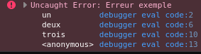

# Comprendre Javascript

## Call Stack ou Pile d'éxecution

Javascript est un langage `single-threaded`, c'est à dire qu'il peut faire, seulement une seule chose à la fois.

Il s'appuie sur une `pile d'éxecution` pour appeler les fonctions les unes après les autres.

Pour rappel en programation, une pile est une structure de données qui fonctionne sur le principe de "dernier arrivé, premier à sortir", (LIFO: Last In First Out)

Concrètement ça veut dire que la dernière fonction qui est appelé est la première à être affiché dans la call stack.

Dans l'exemple suivant on a 3 fonctions qui s'appelent mutuellement.
La dernière fonction appelée est la première affichée en cas d'erreur dans la call stack.

Pourtant on appelle bien `trois()` d'abbord

```js
	function un () {
		throw new Error('Erreur exemple')
	}
	
	function deux () {
		un()
	}

	function trois () {
		deux()
	}

	trois()
```



La call stack montre bien que `trois` est appelé, puis ensuite `deux`, et enfin `un`

ATTENTION l'ordre d'exécution est inversé.

Une seule fonction s'éxecute à la fois et elles s'éxecute à la suite l'une de l'autre.

C'est ce qu'on appele un code synchrone.

## Les primitives

**Booléens**:
Les booléens représentent des etats logiques.
2 valeurs sont possibles, `true` et `false`

**Null**

`null` est un type à lui seul, il permet d'indiquer qu'une valeur est vide (à ne pas confondre avec `undefined`)

**Undefined**

Quand une variable a été déclaré sans valeur, la valeur de cette variable est `undefined`.

`undefined` représente donc une variable sans valeur alors que `null` représente une valeur vide, "nulle"

**Number**

En javascript les nombres entiers (sans virgule ex: 123) et decimaux (avec une virgule ex: 2.5) représentent un seul type.

Ce n'est pas forcément le cas dans d'autres langages comme PHP, ou Java.

`Infinity` et `-Infinity` representent eux l'infini positif et l'infini negatif. Ils sont egalement de type Number

**NaN** 

NaN (Not a Number) est pas vraiment un type en soit.
`NaN` est lui même de type `Number` **mais** il représente de fait un nombre non valide.

On obtient souvent `NaN` suite à une erreur de convertion de types.

**String**
Les `string` ou chaine de caractères représentent du texte simplement.

Il est possible de former des string en utilisant des `""` ou des `''` au tour d'un texte.

Depuis `ES2015` il est possible egalement d'utiliser des `\`\`` pour entourer du texte.
cete dernière forme est appelé `template string`
